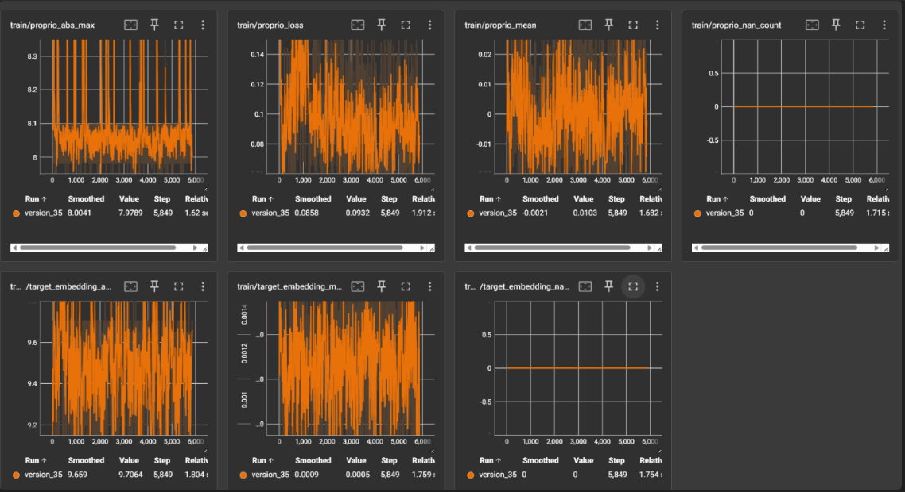
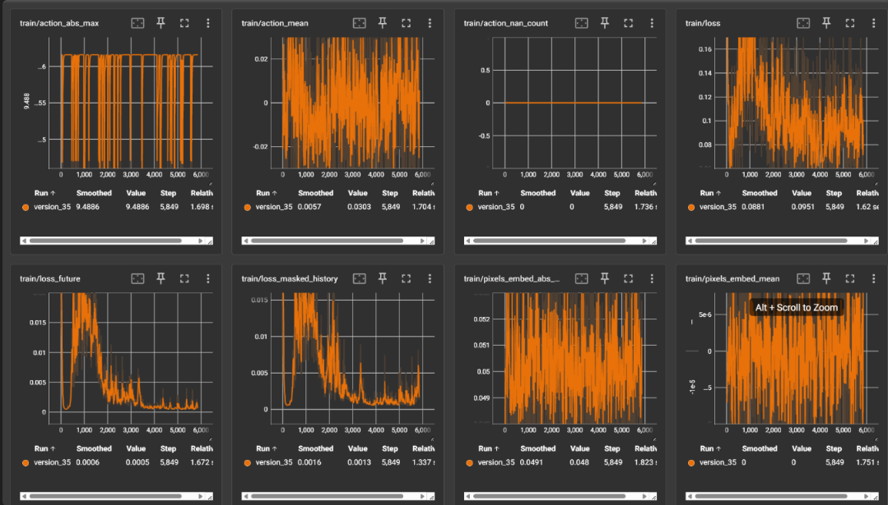
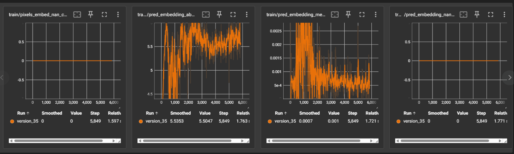

**How I trained (process + technical details)**

1) Data collection
- Record video + agent logs (actions, proprio) saved as CSVs. Keep raw files organized per-episode.

2) Frame extraction
- Sample frames at the configured sampling rate used by the slot extractor (see `configs/config_train_causal_pusht_slot.yaml`). Store frames temporarily for embedding.

3) Slot extraction
- Run the slot extractor (videosaur) on frames to produce per-frame slot arrays. We provide a small helper in `scripts/extract_slots_videosaur_opencv.py` that loads a Videosaur checkpoint, reads an MP4, and saves a pickle mapping `video_id` → ndarray `(T, S, D)`.

How to run (example):
```bash
# single video -> slots pickle
python scripts/extract_slots_videosaur_opencv.py \
  --weight path/to/videosaur_checkpoint.ckpt \
  --video path/to/my_video.mp4 \
  --save_path checkpoints/my_video_slots.pkl \
  --input_size 196 \
  --frame_skip 1 \
  --videosaur_config path/to/videosaur_inference.yaml
```

Notes on parameters and outputs:
- `--weight`: required Videosaur model checkpoint (.ckpt).
- `--video`: input MP4 file.
- `--save_path`: output pickle (default `checkpoints/test_videosaur_slots_opencv.pkl`). The script writes `{ 'train': {basename: slots}, 'val': {} }` so the saved file is directly consumable by the training loader.
- `--input_size`: square resize applied to frames before extraction (default 196). Use the value matching your training `image_size` when possible.
- `--frame_skip`: set >1 to subsample frames (e.g. 3 to keep every 3rd frame).
- `--videosaur_config`: optional YAML to help the script infer model config (NUM_SLOTS, dims). If omitted, provide a checkpoint built with a known config.

- The script normalizes frames to Videosaur's MOVI defaults (mean=0.5, std=0.5) and resizes them before building a tensor for model inference. The extracted `slots` ndarray has shape `(T, n_slots, slot_dim)` and is saved under the original video basename inside the `train` dict key.

- To process multiple videos, run the script in a loop and append each video's slots into a single pickle or save per-video pickles and merge later when packaging the dataset.

4) Align and normalize actions/proprio
- Convert action/proprio CSVs into arrays aligned to frame indices. Compute training mean/std and save as `checkpoints/local_action_meta.pkl` and `checkpoints/local_proprio_meta.pkl` for reproducible normalization.

5) Package dataset
- Create train/val split pickles that map video_id → slot ndarray and aligned action/proprio arrays. These are consumed by `PushTSlotDataset` in `src/custom_codes/custom_dataset.py`.

6) Train
- Command used (example):
```
python scripts/run_real_training.py --config configs/config_train_causal_pusht_slot.yaml --max_steps 200 --batch_size 4
```
- Full run (single GPU):
```
python -m torch.distributed.run --nproc_per_node=1 scripts/run_real_training.py --config configs/config_train_causal_pusht_slot.yaml
```
- Training details taken from the config (exact values): `max_epochs=100`, `batch_size=256`, `predictor_lr=5e-4`, `frameskip=3`, `image_size=224`.

7) Save artifacts
- Checkpoints: saved to `checkpoints/` (e.g. `local_run_bs128_ep50_weights.ckpt`).
- Normalization metadata: `checkpoints/local_action_meta.pkl`, `checkpoints/local_proprio_meta.pkl`.
- Validation outputs (if run): `outputs/val_examples/`, `outputs/val_error_maps/`, `outputs/val_results.json`.


- Code pointers (implementation used by the training scripts):
  - Dataset class: `src/custom_codes/custom_dataset.py` (`PushTSlotDataset`) — this loader consumes slot pickles and action/proprio pickles but accepts any user-provided pickles (your local files under `testdata/` are valid inputs).
  - Predictor implementation: `src/cjepa_predictor.py` (`MaskedSlotPredictor` / `MaskedSlot_AP_Predictor`) — this is the model trained by the scripts.
  - Training entrypoints:
    - Full training (Hydra): `src/train/train_causalwm_from_pusht_slot.py` (uses `PushTSlotDataset` and `MaskedSlotPredictor`).
    - Smoke harness: `scripts/run_real_training.py` (bypasses Hydra; useful for quick local checks).
  - Validation & probes: `scripts/validate_mlagents_counterfactual.py` (and `_safe.py` variant).
- Loss & metrics:
  - `torch.nn.functional.mse_loss(pred, tgt)` averaged across batch/time/slots/dim.
  - RMSE = `sqrt(MSE)`. NRMSE = `RMSE / std(target)`.
-- Normalization note:
  - Always save and reuse training mean/std for actions/proprio. Using different normalization between train and val causes large, misleading absolute MSE differences.

Using your own data (example)
- If you already produced slot/action/proprio pickles in `testdata/`, point the training config to those files. Example (Hydra script):
```bash
# run full training and override file paths
python src/train/train_causalwm_from_pusht_slot.py \
  embedding_dir=testdata/my_slots.pkl \
  action_dir=testdata/my_action_meta.pkl \
  proprio_dir=testdata/my_proprio_meta.pkl \
  trainer.max_epochs=50 \
  batch_size=64
```

- Or for a quick smoke run using the helper script, edit or pass overrides in `scripts/run_real_training.py`'s `cfg` dictionary before calling it (the script's default `cfg` keys are `embedding_dir`, `action_dir`, and `proprio_dir`).

Local dataset used for this run
- This training used the local dataset folder: `C:\soqqle\soqqcjepa\testdata\train01`.
- Expected files inside that folder (examples):
  - `my_slots.pkl` (or `train01_slots.pkl`) — single pickle mapping `{'train': {...}, 'val': {...}}` or per-split files.
  - `my_action_meta.pkl` — pickle mapping `{'train': {video_id: ndarray}, 'val': {...}}`.
  - `my_proprio_meta.pkl` — same structure as actions.
  - (optional) `my_state_meta.pkl`.

If your videos produced per-video pickles, merge them into one combined pickle (PowerShell example):
```powershell
# Merge per-video pickles named slot_<name>.pkl in a folder into combined_slots.pkl
python - <<'PY'
import pickle, glob, os
out = {'train': {}, 'val': {}}
for p in glob.glob(r'testdata\train01\slot_*.pkl'):
    with open(p,'rb') as f:
        d = pickle.load(f)
    # merge into out['train'] primarily
    out['train'].update(d.get('train', {}))
    out['val'].update(d.get('val', {}))
with open(r'testdata\train01\combined_slots.pkl','wb') as f:
    pickle.dump(out,f)
print('wrote combined_slots.pkl')
PY
```

Results (placeholder)





End.

